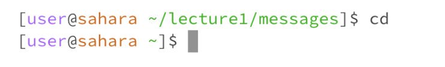

## Lab Report 1- Week 1
----------

The working directory I was in when running the `cd` command with no argument was `/home/lecture1`. 
There was no given output, but we can see that the prefix is back to `[user@sahara ~]$`, demonstrating that the terminal is back in the home directory. Overall the given output leads me to understand that using the command cd with no argument puts the user back in the `/home` directory. To confirm this I tried using `cd` when in the `/lecture1/messages` directory, and it still sent me all the way back to the home directory. Because this command line didn’t have a given output, which is mostly a sign of success, I can determine that there was no error in running this command and it works as intended.

The working directory I was in when initially running the `cd` command with a directory as the argument was the `/home` directory. In the second line I was in the `/home/lecture1` directory. In both lines I used a directory as the argument. Even though there was no output, we can see that the prefix changed both times. The first time running the command with `~/lecture1` as the argument produced the prefix `[user@sahara ~/lecture1]$` demonstrating that the working directory was now `/home/lecture1`. The second line I used the directory `messages/` as the argument and we can see in the following prefix I was then in the `/home/lecture1/messages` directory. Based on both these outcomes, I can conclude that using the `cd` command with a directory as the argument does not produce an error, but rather changes the working directory to the directory given as the argument.

The working directory I was in when running the `cd` command with a file as the argument was `/home/lecture1`. I ran the command `cd README`, trying to access the file `README`. The given output was `bash: cd: README: Not a directory` . The output demonstrates that I can only access directories alongside the `cd` command. This output is an error because the `cd` command is created to change the working directory, so it is impossible to use a file as the argument.

The working directory I was in when running this command was `/home/lecture1` and the command was `ls` with no argument. The output was a list of all the files and directories in the directory I was currently in. I got this output because the command produces a list of all the files and directories in the working directory. This output was not an error because the command works as intended and gives the proper output.

The working directory I was in when running this command was `/home/lecture1` and the command was `ls` with the argument ‘messages/’, meaning that I was using a directory as the argument. The output was a list of all the files in the messages directory (there were no listed directories only because the messages directory does not contain any). This output was not an error message, therefore it is fair to conclude that this was not an error, but rather the command working as intended.

The working directory I was in when running this command was `/home/lecture1`. The command I ran was `ls` with the file `README` as the argument. The output was just `README` which leads me to understand that using a file as the argument for the `ls` command will produce the output of just the file name. This is the case because there are no files or directories within a file to list out, so the terminal produces the output of just the file name. This is not an error, but rather a generally inefficient command to use with a file as the argument because the output just reiterates the file name.

The directory I was working in while using the `cat` command with no arguments was `/home/lecture1`. Initially there was no output, but I also realized that the prefix was gone so I tried to type `hi` into the command line. The output was then `hi`. This led me to understand that using `cat` with no argument causes the terminal to reiterate whatever is typed into it after writing the `cat` command. To get the terminal out of this state I used `^C`, then the terminal went back to normal. This was not an error because there was no output which tends to be a sign of success, but also there was no error message. This leads me to conclude that this is the intentional output of using the `cat` command with no arguments.

The directory I was working in when using the `cat` command and a directory as the argument was `/home/lecture1`. The directory I tried using as the argument was `messages/`, but the directory I chose as the argument made no difference because the output was `cat: messages/: Is a directory`, meaning that you cannot choose a directory to be the argument when using the command `cat`. This output is an error because it demonstrates that I chose the wrong type of argument. I can conclude that the `cat` command cannot be used with directories because it prints the content of the argument, which it cannot do unless the argument is a file.

The directory I was working in when using the `cat` command and a file as the argument was `/home/lecture1`. The file I used as the argument was `README`. The output was the contents of the `README` file. This is the case because the `cat` command prints the contents of the file given as the argument. This output was not an error but was the command working as intended. I know this because not only is there no error message, but output matches exactly what is in the `README` file, which is what the command is supposed to do.
