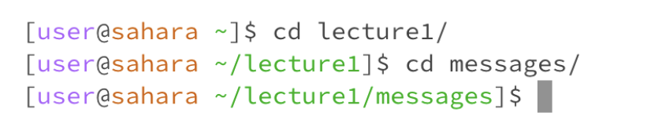

## Lab Report 1- Week 1
----------

The working directory I was in when running the `cd` command with no argument was `/home/lecture1`. 
There was no given output, but we can see that the prefix is back to `[user@sahara ~]$`, demonstrating that the terminal is back in the home directory. Overall the given output leads me to understand that using the command cd with no argument puts the user back in the `/home` directory. To confirm this I tried using `cd` when in the `/lecture1/messages` directory, and it still sent me all the way back to the home directory. Because this command line didn’t have a given output, which is mostly a sign of success, I can determine that there was no error in running this command and it works as intended.

The working directory I was in when initially running the `cd` command with a directory as the argument was the `/home` directory. In the second line I was in the `/home/lecture1` directory. In both lines I used a directory as the argument. Even though there was no output, we can see that the prefix changed both times. The first time running the command with `~/lecture1` as the argument produced the prefix `[user@sahara ~/lecture1]$` demonstrating that the working directory was now `/home/lecture1`. The second line I used the directory `messages/` as the argument and we can see in the following prefix I was then in the `/home/lecture1/messages` directory. Based on both these outcomes, I can conclude that using the `cd` command with a directory as the argument does not produce an error, but rather changes the working directory to the directory given as the argument.
