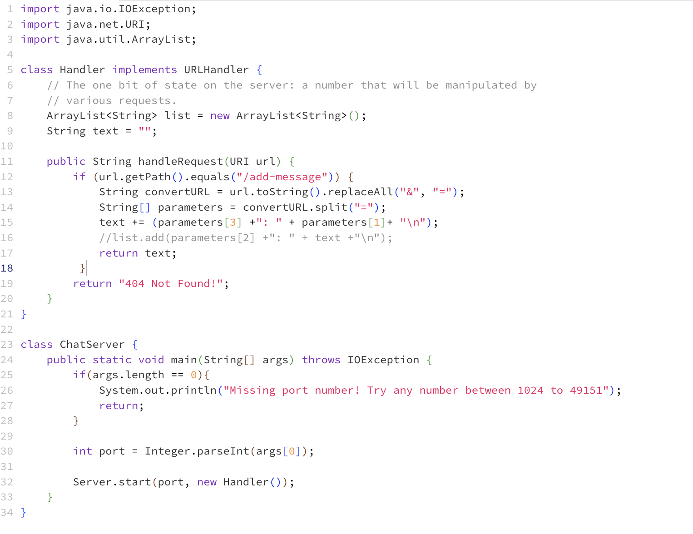
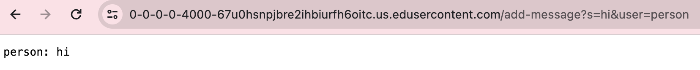
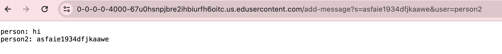
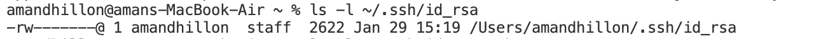
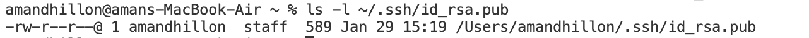
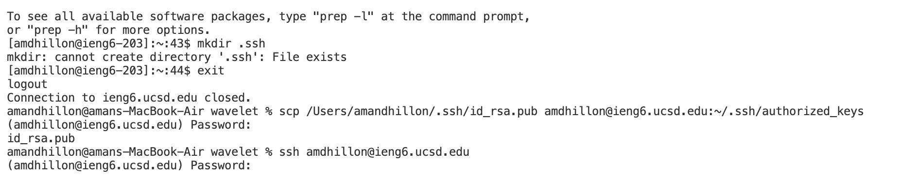

# Lab 2
------
## part 1

* The method(s) in my code that are called for this are: `public String handleRequest(URI url)`
* The relevant argument(s) for this argument is: `if (url.getPath().equals("/add-message"))`
* The values of the relevant fields are as follows:
    * `convertURL = /add-message?s=hi=user=person`
      * The reason I chose to convert all the `&` to `=` was so that I could split the string by the `=` into the parameters field
    * `parameters = {s, hi, user, person}`
    * `text = "person: hi"`
    * The values of these fields depend on the user input in the URL completely because I adjust the fields according to the input so that what is displayed into the web server aligns with the user input.

* The method(s) in my code that are called for this are: `public String handleRequest(URI url)`
* The relevant argument(s) for this argument is: `if (url.getPath().equals("/add-message"))`
* The values of the relevant fields are as follows:
    * `convertURL = /add-message?s=asfaie1934dfjkaawe=user=person2`
        * The reason I chose to convert all the `&` to `=` was so that I could split the string by the `=` into the parameters field
    * `parameters = {s, asfaie1934dfjkaawe, user, person2}`
    * `text = "person: hi"`
              "person2: asfaie1934dfjkaawe"`
    *The values of these fields depend on the user input in the URL completely as I stated before. This time the only field that is relevant is `text` because we choose to print the previous text as well as the new user input. Every other field is independent and solely depends on the new/current user input.

## part 2

* This picture shows the absolute path to the private key for logging into the `ieng6`

* This picture shows the absolute path to the public key for logging into the `ieng6`

* This was an error I was getting. I was unable to log into the `ieng6` in such a way that it did not prompt me to input my password again. I discussed this with the tutors and TA's during the lab period and they figured out I was not doing anything wrong, but it was an error on their end which we still have not figured out.

## part 3
During the last two lab periods I feel as though I learned a lot. I really liked discovering how to create our own web servers because I think it is really interesting and it was cool to see it. Another thing I liked learning about was the ports and when me and another student are logged into the same machine, we are able to access each other's servers. These are both things I did not even know existed before these last couple of weeks, which is why I found it to be so interesting and cool to learn.
