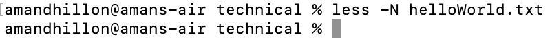
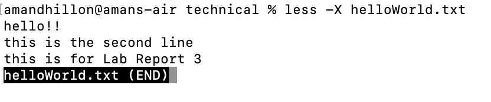

# Lab Report 3
----
## Part 1

The error-inducing code:

    static void reverseInPlace(int[] arr) {
      for(int i = 0; i < arr.length/2; i += 1) {
        int temp = i;
        arr[i] = arr[arr.length - i - 1];
        arr[arr.length-i-1] = temp;
      }
    }

A failure-inducing input for this prorgram is any array with more than one value, such as `int[] input3 = {2,3,4,5 };`

The JUnit test that demonstrates this is 

    public void testReverseInPlace() {
      int[] input3 = {2,3,4,5 };
      ArrayExamples.reverseInPlace(input3);
      assertArrayEquals(new int[]{ 5,4,3,2 }, input3);
    }

An input that does not induce any error is `int[] input1 = { 3 };` or `int[] input2 = { };`

The JUnit tests that demonstrate this are:

    public void testReverseInPlace() {
      int[] input1 = { 3 };
      ArrayExamples.reverseInPlace(input1);
      assertArrayEquals(new int[]{ 3 }, input1);`

      int[] input2 = { };
      ArrayExamples.reverseInPlace(input2);
      assertArrayEquals(new int[]{ }, input2);
    }

The symptom is that the second value of the supposed outputted array should have been 3, but was instead 1. This was with the first, failure-inducing, input. The empty and single valued arrays passed their tests.

The corrected code was:

    static void reverseInPlace(int[] arr) {
      for(int i = 0; i < arr.length/2; i += 1) {
        int temp = arr[i];
        arr[i] = arr[arr.length - i - 1];
        arr[arr.length-i-1] = temp;
      }
    }

The initial code was:

    static void reverseInPlace(int[] arr) {
      for(int i = 0; i < arr.length/2; i += 1) {
        int temp = i;
        arr[i] = arr[arr.length - i - 1];
        arr[arr.length-i-1] = temp;
      }
    }

The bug was that the `int temp` was set equal to the index `i` initially, which at the end changes the array's values to match the index, not the reversed order. 
This is why after the fix, changing it to `int temp = arr[i]`, the value of temp holds the array's value at the index and changes the order of the values with the correct numbers, not the value of `i`.

----
## Part 2: Researching Commands

I chose to research the `less` command.
The `less` command is used to view files in the terminal, which is why the images of calling the variants of `less` on directories has no valid outputs.
Here is what `less` looks like when being called on a directory:

and when I use `less helloWorld.txt`, which is a file:

The first alternative I found was the `less -N` command, which displays the line number next to the each file line. This is useful when the file is very long and you need to refer to specific line numbers.
This had the following outputs on a file:

Here was the output for calling the command on a directory:

The second alternative I found was the `less -F` command, this causes the terminal to immediately exit the file if it can be displayed on one screen, which is useful to quickly view short files.
This had the following outputs on a file versus a directory:

The third alternative I found was the `less -X` command, which allows the user to stay in the terminal while viewing the file. This is useful because the screen is not clearing and the user can retain context of the terminal while viewing the file. 
This had the following outputs on a file versus the directory:

The fourth alternative I found was the `less + F` command, which starts the output at the end of the file. This is useful for handling log files. When new lines are added to the file, the command will display them immediately without having to manually reload the file. This is also useful to find erros as they occur and track the continuous process of adding to the file.
This had the following outputs on a file versus a directory:

----
## Sources used:
[Source 1](https://ioflood.com/blog/less-linux-command/#:~:text=The%20'more'%20command%20is%20similar,through%20a%20file%2C%20not%20backward.&text=To%20navigate%20to%20the%20next%20screen%2C%20simply%20press%20the%20spacebar.)

[Source 2](https://unix.stackexchange.com/questions/86321/how-can-i-display-the-contents-of-a-text-file-on-the-command-line)

[Less Command in Linux](https://phoenixnap.com/kb/less-command-in-linux)
