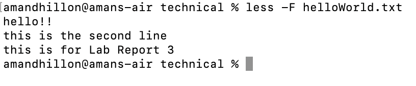

# Lab Report 3
----
## Part 1

The error-inducing code:

    static void reverseInPlace(int[] arr) {
      for(int i = 0; i < arr.length/2; i += 1) {
        int temp = i;
        arr[i] = arr[arr.length - i - 1];
        arr[arr.length-i-1] = temp;
      }
    }

A failure-inducing input for this prorgram is any array with more than one value, such as `int[] input3 = {2,3,4,5 };`

The JUnit test that demonstrates this is 

    public void testReverseInPlace() {
      int[] input3 = {2,3,4,5 };
      ArrayExamples.reverseInPlace(input3);
      assertArrayEquals(new int[]{ 5,4,3,2 }, input3);
    }

An input that does not induce any error is `int[] input1 = { 3 };` or `int[] input2 = { };`

The JUnit tests that demonstrate this are:

    public void testReverseInPlace() {
      int[] input1 = { 3 };
      ArrayExamples.reverseInPlace(input1);
      assertArrayEquals(new int[]{ 3 }, input1);`

      int[] input2 = { };
      ArrayExamples.reverseInPlace(input2);
      assertArrayEquals(new int[]{ }, input2);
    }

The symptom is that the second value of the supposed outputted array should have been 3, but was instead 1. This was with the first, failure-inducing, input. The empty and single valued arrays passed their tests.

The corrected code was:

    static void reverseInPlace(int[] arr) {
      for(int i = 0; i < arr.length/2; i += 1) {
        int temp = arr[i];
        arr[i] = arr[arr.length - i - 1];
        arr[arr.length-i-1] = temp;
      }
    }

The initial code was:

    static void reverseInPlace(int[] arr) {
      for(int i = 0; i < arr.length/2; i += 1) {
        int temp = i;
        arr[i] = arr[arr.length - i - 1];
        arr[arr.length-i-1] = temp;
      }
    }

The bug was that the `int temp` was set equal to the index `i` initially, which at the end changes the array's values to match the index, not the reversed order. 
This is why after the fix, changing it to `int temp = arr[i]`, the value of temp holds the array's value at the index and changes the order of the values with the correct numbers, not the value of `i`.

----
## Part 2: Researching Commands

I chose to research the `less` command.
Here are the outputs of the terminal when I use `less biomed/`, which is a directory:

and when I use `less helloWorld.txt`, which is a file:

The first alternative I found was the `more` command, which had the following outputs:

The second alternative I found was the `echo "$(<filename)"` command, which had the following outputs:

The third alternative I found was the `more` command, which had the following outputs:

The fourth alternative I found was the `cat` command, which had the following outputs:

