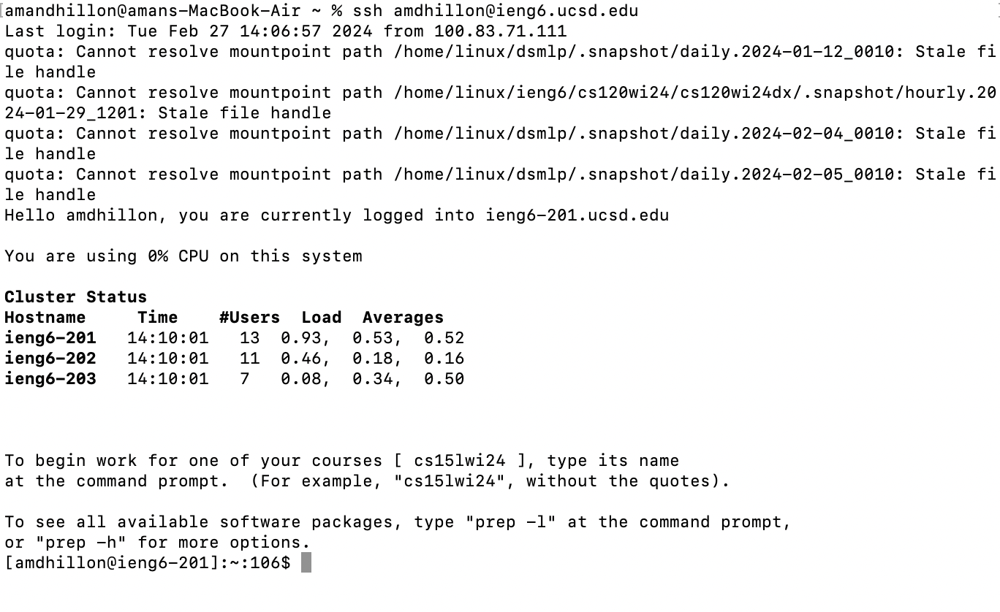
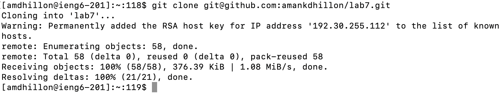
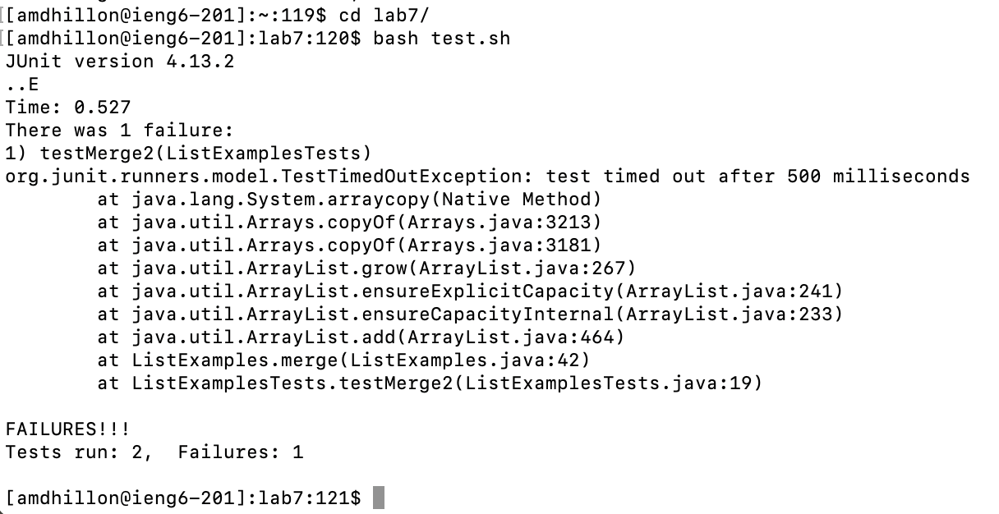
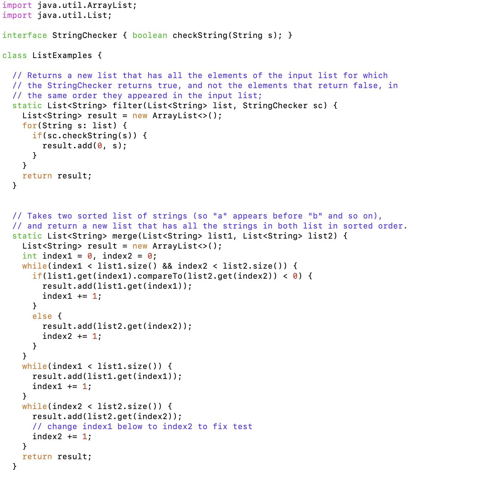
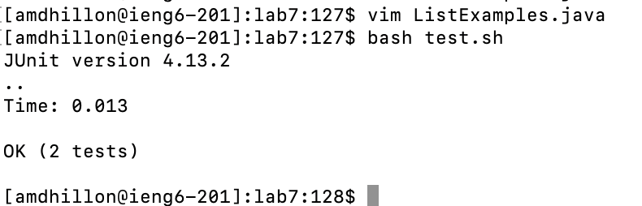
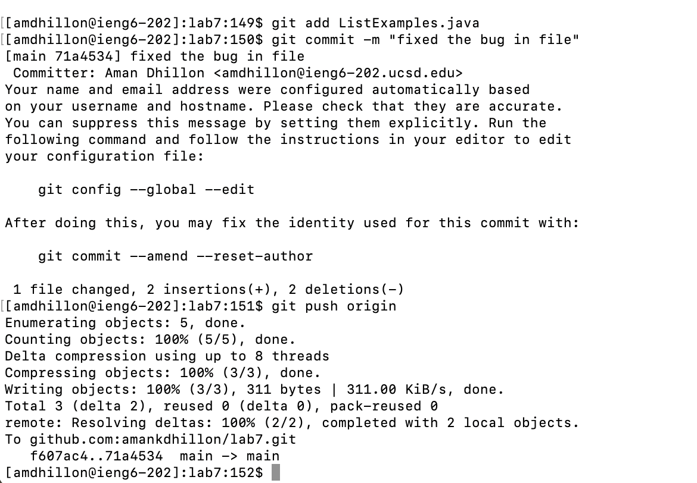
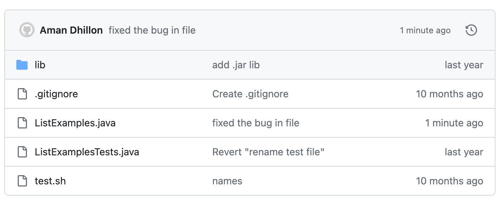

# Lab 4: Vim
-----

## Step 4: Log into ieng6

To log into my `ieng6` account I used the steps: `ssh amdhillon@ieng6.ucsd.edu` `<enter>`

Here is the image of me successfully logging into the account:

## Step 5: Clone your fork of the repository from your Github account (using the SSH URL)

To clone the fork of the respository from my GitHub account I used the steps: `git clone git@github.com:amankdhillon/lab7` `<enter>`

Here is the image of me successfully cloning the respository using the `SSH` URL:

## Step 6: Run the tests, demonstrating that they fail

To run the tests I used the following steps: `cd lab7/` `bash test.sh` `<enter>`

I had to change the directory to the `lab7` directory after cloning it and ran the `test.sh` file to run the tests.

Here is the image of me running the tests and showing that they fail:

## Step 7: Edit the code file to fix the failing test

To edit the code file to fix the test I used the following steps:

`vim ListExamples.java` `<G> <up><up><up><up><up><up> <2w> <left><left> <x> <i><2> <:wq>`

I did these steps to open and edit the file, then the `<G>` key moved me all the way to the bottom, because that was closest to the number I had to change. I then moved up 6, 2 words to the right, and 2 keys to the left to access the number I needed to remove. I used the `<x>` key to remove the number and `<i>` to insert the correct number 2.

Here is the image of my updates `ListExamples.java` file:

## Step 8: Run the tests, demonstrating that they now succeed

To re-run the tests I used the following steps: `bash test.sh` `<enter>`

Here is the image of me running the tests and showing that they all pass:

## Step 9: Commit and push the resulting change to your Github account (you can pick any commit message!)

To commit and push the resulting change to my GitHub accounts I used the steps:

`git add ListExamples.java` `git commit -m "fixed the bug in file"` `git push origin`

These steps: 

`git add ListExamples.java`: Stages the changes/modifications I made in the `ListExamples.java` file and prepares them to be included in the next `commit` command.

`git commit -m "fixed the bug in file"`: Commits the staged changes with the given message, documenting the changes made.

`git push origin`: Pushes the committed changes to the remote repository's branch, which is `main` in this case and is the branch the I am currently working on.

Here is the image of me committing and pushing the changes:

And here is the image of my GitHub page, demonstrating that the changes were successfully commited and pushed:

