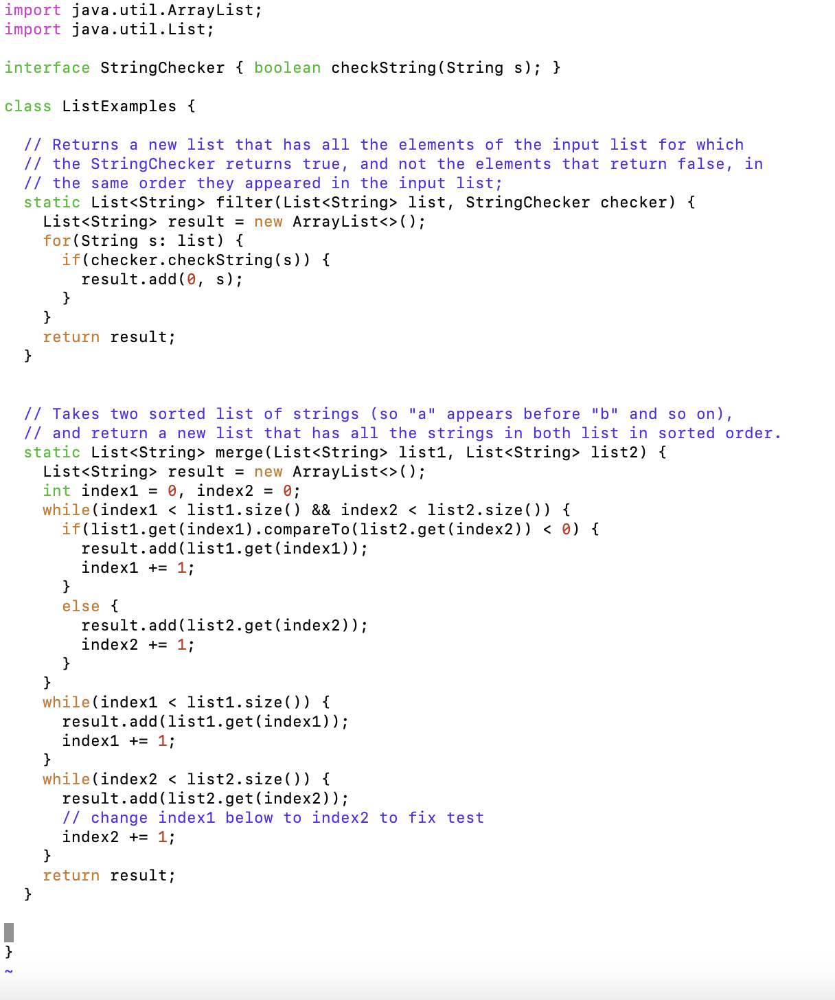
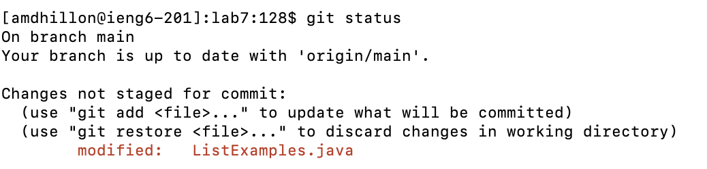
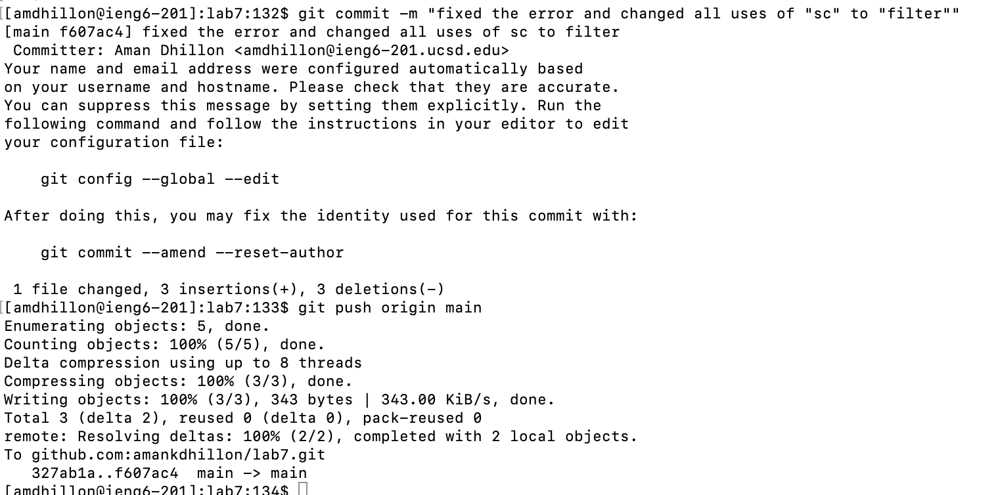
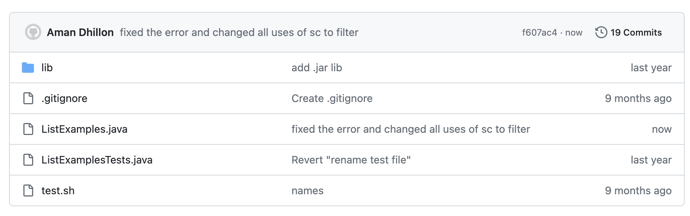

# Lab 4: Vim
-----

## Step 4: Log into ieng6

To log into my `ieng6` account I used the steps: `ssh amdhillon@ieng6.ucsd.edu` `<enter>`

Here is the image of me successfully logging into the account:

## Step 5: Clone your fork of the repository from your Github account (using the SSH URL)

To clone the fork of the respository from my GitHub account I used the steps: `git clone "SSH URL"` `<enter>`

Here is the image of me successfully cloning the respository using the `SSH` URL:

## Step 6: Run the tests, demonstrating that they fail

To run the tests I used the following steps: `cd lab7/` `bash test.sh` `<enter>`

I had to change the directory to the `Lab7` directory after cloning it and ran the `test.sh` file to run the tests.

Here is the image of me running the tests and showing that they fail:

## Step 7: Edit the code file to fix the failing test

To edit the code file to fix the test I used the following steps:

`vim ListExamples.java` `<G> <up><up><up><up><up><up> <2w> <left><left> <x> <i><2> <:wq>`

I did these steps to open and edit the file, then the `<G>` key moved me all the way to the bottom, because that was closest to the number I had to change. I then moved up 6, 2 words to the right, and 2 keys to the left to access the number I needed to remove. I used the `<x>` key to remove the number and `<i>` to insert the correct number 2.

After saving and exiting the file, I decided to try another practice from the Week 7 Lab, which was to change all the instances of the `sc` parameter to `checker`. I understand that it was inefficient to exit and have to re-enter the file, but I only decided to do this after already exiting.

Here are the steps I did to change the instances of `sc` to `checker`:

`vim ListExamples.java` `<gg> <down><down><down><down><down><down><down><down><down><down> <15w> <x><x> <i><checker> <up><up><up> <0> <3w> <x><x> <i><checker> <:wq> <enter>`

I did these steps to re-open the file and edit it. The `<gg>` command moved my cursor all the way to the top of the file. I then used the `<down>` key 10 times to get to the line where `sc` was first used. I then moved 15 words to the right, because that was where `sc` was. I used the `<x>` key twice to delete `sc` and used `<i>` to insert the word `checker`. I then moved down another 3 lines because that is where the other use of `sc` was. I used the `<0>` key because that moved me to the beginning of the line, which was closer to the `sc` I needed to replace. I then used the `<3w>` key to move three words to the right and then used `<x>` twice to delete `sc` and used `<i>` to insert the word `checker` again. I used `<:wq>` to save and quit the file.

Here is the image of my updates `ListExamples.java` file:

## Step 8: Run the tests, demonstrating that they now succeed

To re-run the tests I used the following steps: `bash test.sh` `<enter>`

Here is the image of me running the tests and showing that they all pass:

## Step 9: Commit and push the resulting change to your Github account (you can pick any commit message!)

To commit and push the resulting change to my GitHub accounts I used the steps:

`git status` `git add .` `git commit -m "fixed the error and changed all uses of "sc" to "filter""` `git push origin main`

These steps: check the status of my repository, sets up the changes I want to commit, commits the changes with the given message, and pushes my changes to the main branch.

Here is the image of me committing and pushing the changes:

And here is the image of my GitHub page, demonstrating that the changes were successfully commited and pushed:

