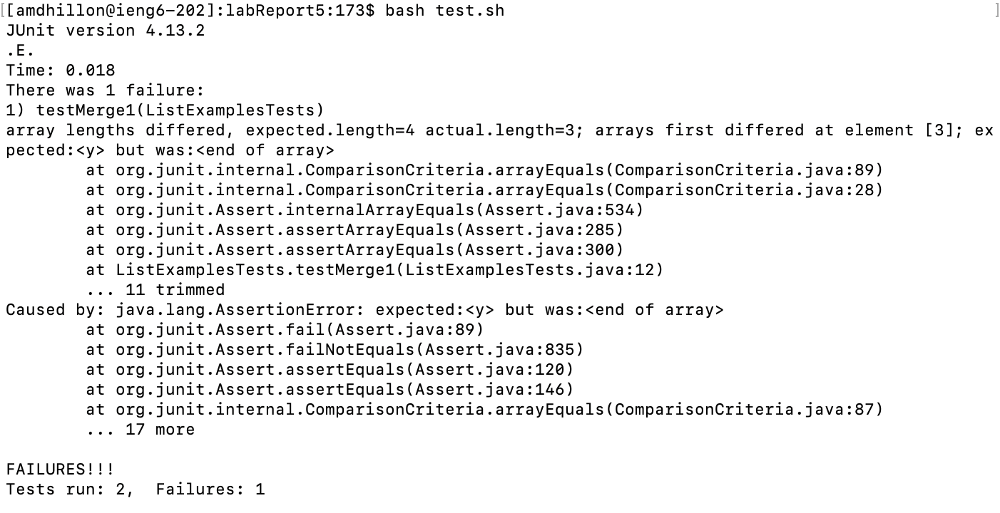
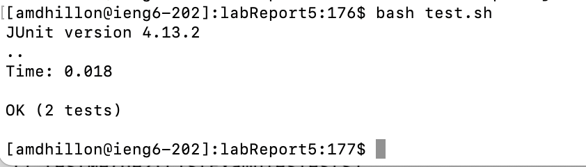

# Lab 5: Putting It All Together
----------------
## The original post from a student with a screenshot showing a symptom and a description of a guess at the bug/some sense of what the failure-inducing input is.



I ran my test script for my Java program, and it is failing one of the test cases. The output is showing that there is a failure in the testMerge1 method of ListExamplesTests.java. It is saying that there is a difference in array lengths and that it expected the element at index 3 to be y, but it was at the end of array instead.

I think that the issue might be related to how I am merging arrays in my ListExamples class. Is the issue that the merge method is not handling the end-of-array condition correctly, I am not sure what it could be?


## A response from a TA asking a leading question or suggesting a command to try (To be clear, you are mimicking a TA here.)

Hi there,

It looks like there's an issue with the testMerge1 method in your tester. The error message shows that there is a difference in array lengths and that it expected the element at index 3 to be y, but it was at the end of the array.

To further debug this, have you checked the implementation of your merge method in the ListExamples class? It looks like there could be a problem with how you are handling the merging of arrays.

One specific thing you can check is how you're handling the case when one of the arrays is shorter than the other. Make sure that your merge algorithm correctly handles this case and does not try to access elements after the end of the shorter array. You could also try running some test cases with arrays of different lengths to see if you encounter similar issues.

Another specific thing you could check is the loop conditions in your while loops. Pay attention to how you are updating the loop indices (index1 and index2). Make sure that the loops ends correctly and does not miss any elements.

Let me know if you need further assistance or if you have any other questions!


## Another screenshot/terminal output showing what information the student got from trying that, and a clear description of what the bug is.



The bug in the merge method is casued by the incorrect merging of the input lists. Specifically, the index incrementing inside the second while loop (index1) is incorrect, leading to potentially skipping elements or accessing out-of-bounds indices. The bug specifically was the line `index1 += 2;`. The index is only supposed to increment by 1. Thank you for your help, the bug was solved!


## At the end, all the information needed about the setup including:


### The file & directory structure needed:

```bash

  labReport5/
  |-  ListExamples.class
  |-  ListExamples.java  
  |-  ListExamplesTests.class  
  |-  ListExamplesTests.java  
  |-  StringChecker.class  
  |-  test.sh
  |-  lib 
        |-  hamcrest-core-1.3.jar  
        |-  junit-4.13.2.jar

```

  
### The contents of each file before fixing the bug
  `ListExamples.java` :
```bash
import java.util.ArrayList;
import java.util.List;

interface StringChecker { boolean checkString(String s); }

class ListExamples {

  // Returns a new list that has all the elements of the input list for which
  // the StringChecker returns true, and not the elements that return false, in
  // the same order they appeared in the input list;
  static List<String> filter(List<String> list, StringChecker sc) {
    List<String> result = new ArrayList<>();
    for(String s: list) {
      if(sc.checkString(s)) {
        result.add(0, s);
      }
    }
    return result;
  }


  // Takes two sorted list of strings (so "a" appears before "b" and so on),
  // and return a new list that has all the strings in both list in sorted order.
  static List<String> merge(List<String> list1, List<String> list2) {
    List<String> result = new ArrayList<>();
    int index1 = 0, index2 = 0;
    while(index1 < list1.size() && index2 < list2.size()) {
      if(list1.get(index1).compareTo(list2.get(index2)) < 0) {
        result.add(list1.get(index1));
        index1 += 1;
      }
      else {
        result.add(list2.get(index2));
        index2 += 1;
      }
    }
    while(index1 < list1.size()) {
      result.add(list1.get(index1));
      index1 += 2;
    }
    while(index2 < list2.size()) {
      result.add(list2.get(index2));
      index2 += 1;
    }
    return result;
  }


}
```

  `ListExamplesTests.java`:
  
```bash
import static org.junit.Assert.*;
import org.junit.*;
import java.util.*;
import java.util.ArrayList;


public class ListExamplesTests {
	@Test(timeout = 500)
	public void testMerge1() {
    		List<String> l1 = new ArrayList<String>(Arrays.asList("x", "y"));
		List<String> l2 = new ArrayList<String>(Arrays.asList("a", "b"));
		assertArrayEquals(new String[]{ "a", "b", "x", "y"}, ListExamples.merge(l1, l2).toArray());
	}
	
	@Test(timeout = 500)
        public void testMerge2() {
		List<String> l1 = new ArrayList<String>(Arrays.asList("a", "b", "c"));
		List<String> l2 = new ArrayList<String>(Arrays.asList("c", "d", "e"));
		assertArrayEquals(new String[]{ "a", "b", "c", "c", "d", "e" }, ListExamples.merge(l1, l2).toArray());
        }

}

```
  `test.sh`:
  
```bash
  javac -cp .:lib/hamcrest-core-1.3.jar:lib/junit-4.13.2.jar *.java
  java -cp .:lib/hamcrest-core-1.3.jar:lib/junit-4.13.2.jar org.junit.runner.JUnitCore ListExamplesTests

  `StringChecker.class`: This is a binary file so it could not transfer into the webpage properly. (only showed up after running the code)
  `ListExamples.class`: This is a binary file so it could not transfer into the webpage properly. (only showed up after running the code)
  `ListExamplesTests.class` : This is a binary file so it could not transfer into the webpage properly. (only showed up after running the code)
```
  `lib`:   
        `hamcrest-core-1.3.jar` : This file was not accessible to copy and paste as a code block in gitHub.  
        `junit-4.13.2.jar` : This file was not accessible to copy and paste as a code block in gitHub.

### The contents of the files after fixing the bug:
`ListExamples.java` :
```bash
import java.util.ArrayList;
import java.util.List;

interface StringChecker { boolean checkString(String s); }

class ListExamples {

  // Returns a new list that has all the elements of the input list for which
  // the StringChecker returns true, and not the elements that return false, in
  // the same order they appeared in the input list;
  static List<String> filter(List<String> list, StringChecker sc) {
    List<String> result = new ArrayList<>();
    for(String s: list) {
      if(sc.checkString(s)) {
        result.add(0, s);
      }
    }
    return result;
  }


  // Takes two sorted list of strings (so "a" appears before "b" and so on),
  // and return a new list that has all the strings in both list in sorted order.
  static List<String> merge(List<String> list1, List<String> list2) {
    List<String> result = new ArrayList<>();
    int index1 = 0, index2 = 0;
    while(index1 < list1.size() && index2 < list2.size()) {
      if(list1.get(index1).compareTo(list2.get(index2)) < 0) {
        result.add(list1.get(index1));
        index1 += 1;
      }
      else {
        result.add(list2.get(index2));
        index2 += 1;
      }
    }
    while(index1 < list1.size()) {
      result.add(list1.get(index1));
      index1 += 1;
    }
    while(index2 < list2.size()) {
      result.add(list2.get(index2));
      index2 += 1;
    }
    return result;
  }


}
```

All the other file contents were the same.

  
### The full command line (or lines) you ran to trigger the bug
The full command line I used to trigger the bug was: `bash test.sh`

###  A description of what to edit to fix the bug

Since the bug was that in the second while loop, `index1` was being incremented by 2 instead of 1, the merging of arrays would be skipping over elements, and could even try to access out-of-bounds indices. The edit to fix the bug was changing the 2 to a 1, which as a result made the line now: `index1 +=1;`


## Reflection:

My favorite thing that I learned in lab during the second half of the quarter was the application of `vim` and how easy it was to edit and navigate files while working in the terminal. I also liked learning the shortcuts to navigate the files, such as <G> , <gg>, <0>, etc. These skill significantly made my coding workflow much easier and boosted my productivity during lab sessions.
